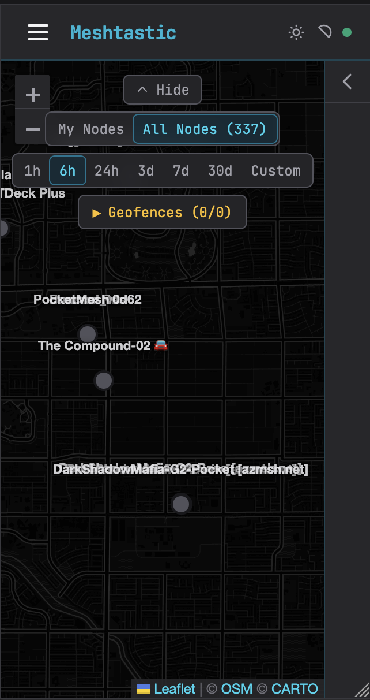
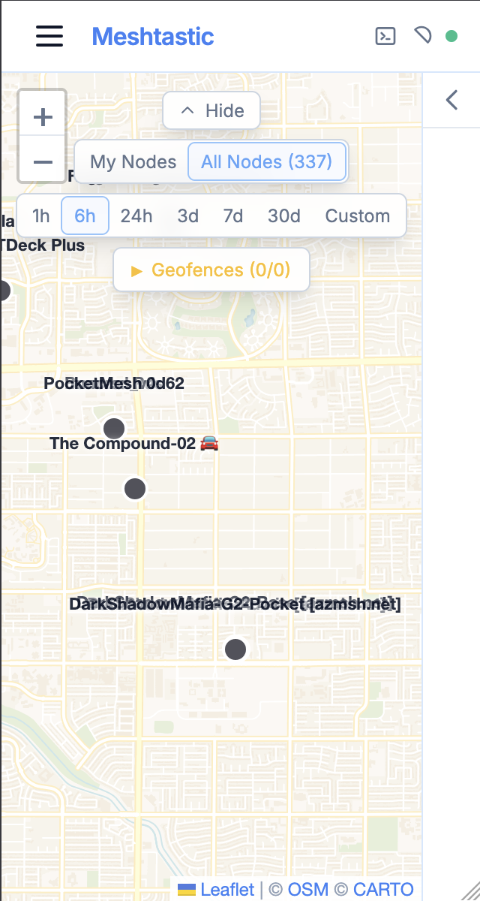
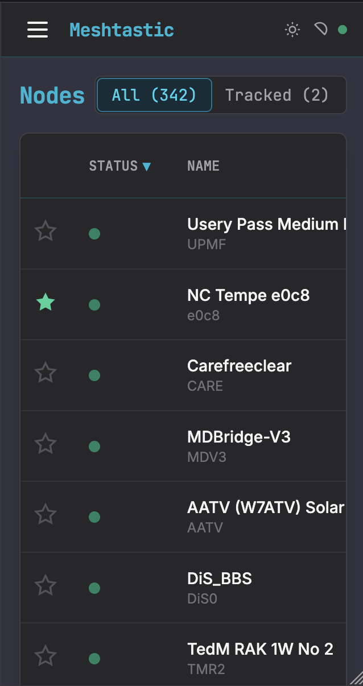
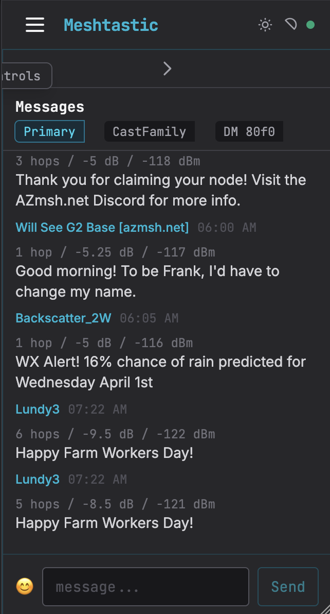

# Meshtastic Tracker

A self-hosted web dashboard for monitoring Meshtastic LoRa mesh networks. Always-on TCP gateway with persistent position history, movement trails, multi-channel messaging, emoji reactions, and geofence alerts.

## Screenshots

| Map (Dark) | Map (Light) |
|---|---|
|  |  |

| Nodes | Messages |
|---|---|
|  |  |

## How is this different from the official Meshtastic web client?

The [official client](https://client.meshtastic.org) connects directly from your browser to a radio — it's a device configuration tool. If the browser tab closes, everything stops.

This project runs a **persistent backend** that connects to your radio over TCP and stores everything in a database. It works whether or not anyone has a browser open.

| | Official Client | This Project |
|---|---|---|
| Connection | Browser → Radio (BLE/Serial/HTTP) | Server → Radio (TCP), always-on |
| Data persistence | Browser only (lost on refresh) | SQLite (survives restarts) |
| Position history | None | Days/weeks of stored positions with trails |
| Geofence alerts | Not possible (no backend) | Webhook notifications when nodes leave an area |
| Multi-client | One browser = one connection | Any number of browsers via WebSocket |
| Device config | Full settings UI (channels, LoRa, modules) | Not supported — use the official client for that |

**Use the official client for one-time device setup. Use this project for ongoing monitoring.**

## Features

- **Real-time map** with node markers, movement trail polylines, and geofence circles (Leaflet + MapLibre GL, basemap via [OpenFreeMap](https://openfreemap.org/) — no API key, no request limits, and a self-hosted offline mode is available, see [Basemap](#basemap))
- **Multi-channel messaging** with send/receive, emoji reactions, and drag-to-reorder channel tabs
- **Direct messages** — per-node DM threads, opened from the Nodes list, a map marker popup, or a node's details page
- **Node details page** — click any node for its telemetry, position trail on a mini map, DM thread, and on-demand traceroute
- **Traceroute** — request a live route to any node and see per-hop SNR; last result persists across reloads
- **Mesh topology** — hop-count column on the Nodes page, sourced from the device nodedb and live packets
- **Node tracking** — star devices to filter the map to "My Nodes" with per-node visibility toggles
- **Online filter** — narrow the Nodes table to only currently-reachable devices
- **Position history** — SQLite stores days/weeks of positions, configurable auto-pruning
- **Geofence alerts** — define geographic boundaries, get webhook notifications when tracked nodes leave
- **Per-node color coding** — deterministic hash-based palette, consistent across map, trails, and messages
- **Dual theme** — dark hacker (cyan) and light corporate (blue), persisted per-browser
- **API key auth** — optional shared key protects all endpoints (opt-in via env var)
- **Health API** — `/api/health` endpoint for external monitoring (e.g., n8n, Uptime Kuma)
- **WebSocket broadcasting** — real-time position, message, reaction, node, geofence, and traceroute events to all connected clients
- **Stale node detection** — automatic offline marking after configurable timeout

## Architecture

```
Meshtastic Radio (TCP mode, e.g. Heltec V3)
    |  TCP :4403
FastAPI + meshtastic-python (always-on gateway)
    |  SQLite (nodes, positions, messages, geofences)
    |  REST API + WebSocket
React SPA (Vite + Tailwind + Leaflet, basemap via MapLibre GL)
```

## Quick Start

```bash
git clone https://github.com/nathanrcast/meshtastic-tracker.git
cd meshtastic-tracker
cp .env.example .env
# Edit .env — set MESHTASTIC_HOST to your device's IP
docker compose up -d --build
```

Open `http://<your-host>:8200` in a browser.

## Prerequisites

- Docker and Docker Compose
- A Meshtastic device with TCP server enabled and WiFi connected to your LAN
  - In the Meshtastic app: **Settings > Network > WiFi** (connect to your LAN). TCP server is enabled by default when WiFi is connected.

## Basemap

The map works out of the box with no configuration — it uses [OpenFreeMap](https://openfreemap.org/) hosted vector tiles: no API key, no signup, no request limits.

If you'd rather have zero external tile requests (e.g. the app should keep working with no internet), self-host a [Protomaps](https://protomaps.com/) basemap instead:

```bash
# 1. Install the pmtiles CLI: https://github.com/protomaps/go-pmtiles/releases
# 2. Pick a recent daily build: https://maps.protomaps.com/builds
# 3. Extract your region — bbox is min_lon,min_lat,max_lon,max_lat
#    (find one at http://bboxfinder.com)
mkdir -p tiles
pmtiles extract https://build.protomaps.com/<YYYYMMDD>.pmtiles \
  tiles/basemap.pmtiles --bbox=<MIN_LON>,<MIN_LAT>,<MAX_LON>,<MAX_LAT> --maxzoom=15
```

Then in `.env` set `BASEMAP_MODE=pmtiles`, uncomment the `./tiles:/app/tiles:ro` volume line in `docker-compose.yml`, and `docker compose up -d`.

`--maxzoom=15` is the daily build's native max zoom — MapLibre overzooms cleanly past it in the UI, just without extra street-level detail. Re-run the extract against a newer daily build occasionally, since OSM data drifts over time.

## Environment Variables

| Variable | Default | Description |
|---|---|---|
| `MESHTASTIC_HOST` | *(required)* | IP address of the Meshtastic TCP device |
| `MESHTASTIC_PORT` | `4403` | TCP port on the device |
| `RECONNECT_INTERVAL` | `15` | Seconds between reconnect attempts |
| `STALE_MINUTES` | `15` | Minutes before a node is marked offline |
| `DATABASE_URL` | `sqlite:///data/meshtastic.db` | SQLAlchemy database URL |
| `API_KEY` | *(empty — auth disabled)* | Shared API key. If set, all endpoints except `/api/health` require `X-API-Key` header |
| `PRUNE_DAYS` | `30` | Auto-delete positions, messages, and reactions older than this many days (runs on startup) |
| `GEOFENCE_WEBHOOK_URL` | *(empty — disabled)* | URL to POST a JSON payload when a tracked node exits a geofence |
| `BASEMAP_MODE` | `openfreemap` | `openfreemap` (hosted, no key/limits) or `pmtiles` (self-hosted, offline-capable — see [Basemap](#basemap)) |
| `MAP_DEFAULT_CENTER` | `0,0` | Initial map view before any node data arrives (`lat,lon`) |
| `MAP_DEFAULT_ZOOM` | `2` | Initial map zoom before any node data arrives |

### Geofence Webhook Payload

When a tracked node leaves an enabled geofence, the server POSTs:

```json
{
  "event": "geofence_exit",
  "node_id": "!abc12345",
  "node_name": "Device Name",
  "fence_name": "Home",
  "distance_m": 1523
}
```

## Device Setup Guide

### Base Station (TCP Gateway)

The base station stays at home, connected to your LAN, and acts as the TCP gateway.

1. Flash Meshtastic firmware via the [web flasher](https://flasher.meshtastic.org/)
2. Pair via the Meshtastic Android/iOS app over Bluetooth
3. Configure WiFi: **Settings > Network > WiFi** > enter SSID and password
4. Assign a static IP or DHCP reservation on your router
5. Set `MESHTASTIC_HOST` in `.env` to this IP

### Channel Setup (Private Precise Location)

Keep the default public channel (e.g., LongFast) as primary and add a private channel as secondary with full-precision location. Recent firmware versions allow per-channel position precision — a secondary channel with precision set will broadcast location on that channel independently.

On the base station (via the Meshtastic app):

1. **Settings > Channels** > edit the primary channel (index 0, e.g., LongFast)
2. Set position precision to **0** (disabled) so your location is not shared publicly
3. Add a secondary channel (e.g., "Family") with a new PSK (pre-shared key) — save this for other devices
4. Set position precision to **32** (full precision) on the secondary channel

> **Why keep the default channel as primary?** Setting a private channel as primary prevents your node from being discovered by other Meshtastic users and degrades traceroutes — intermediate nodes that don't share your private channel will appear as unknown. Keeping the default channel primary preserves mesh discoverability while the secondary channel handles private location sharing.

### Additional Devices

Each device that should appear on the map:

1. Install the [Meshtastic app](https://meshtastic.org/downloads/) and pair via Bluetooth
2. Set position precision to **0** on the primary channel (index 0)
3. Add the same secondary channel name and PSK from above
4. Set position precision to **32** on the secondary channel
5. Ensure GPS is enabled: **Settings > Position > GPS Enabled**
6. For stationary devices without GPS, set a fixed position: **Settings > Position > Fixed Position**

### Using the Web App

1. Open the web app and go to the **Nodes** page
2. Star each device you want to track (click the star icon); filter to **Online** or **Tracked** as needed, and sort by hop count to see mesh topology
3. Click a node to open its **details page** — telemetry, position trail, a DM thread, and a **Run traceroute** button
4. On the **Map** page, "My Nodes" shows only starred devices with colored markers and trails
5. Use the message panel to send and receive on any channel, or click a node's name to open a DM
6. Open the **Geofences** panel to define alert boundaries

## API Endpoints

| Method | Route | Description |
|---|---|---|
| `GET` | `/api/nodes` | List all nodes (`?tracked=true` for starred only) |
| `GET` | `/api/nodes/{id}` | Single node (used by the details page) |
| `PATCH` | `/api/nodes/{id}/tracked` | Star/unstar a node |
| `GET` | `/api/nodes/{id}/positions` | Position history (`?hours=24` or `?start=&end=` ISO datetimes) |
| `POST` | `/api/nodes/{id}/traceroute` | Request a live traceroute; result arrives over the WebSocket |
| `GET` | `/api/nodes/{id}/traceroute` | Last stored traceroute result for a node |
| `GET` | `/api/channels` | Active channels from device |
| `GET` | `/api/messages` | Channel messages (`?channel=0&limit=100`) |
| `POST` | `/api/messages` | Send a message (`{"text": "...", "channel": 0}`, add `"to_id"` for a DM) |
| `POST` | `/api/messages/{packet_id}/react` | Send an emoji reaction (`{"emoji": "👍"}`) |
| `GET` | `/api/messages/dm/{peer_id}` | Direct message history with a specific node |
| `GET` | `/api/conversations` | List of active DM threads |
| `GET` | `/api/geofences` | List all geofences |
| `POST` | `/api/geofences` | Create a geofence |
| `PATCH` | `/api/geofences/{id}` | Update a geofence |
| `DELETE` | `/api/geofences/{id}` | Delete a geofence |
| `POST` | `/api/disconnect` | Release the radio's TCP slot (e.g. to use the phone app) |
| `POST` | `/api/reconnect` | Reconnect after a manual disconnect |
| `GET` | `/api/health` | Health check (always open, no auth required) |
| `WS` | `/api/ws` | Real-time events (position, message, reaction, node_update, geofence_exit, traceroute) |

## License

[MIT](LICENSE)
